# Tugas 1
### Server dijalankan di 3 server yang berbeda, masing-masing client connect ke server tersebut
Kondisi awal server dengan port 3100,3101,3102 menyala
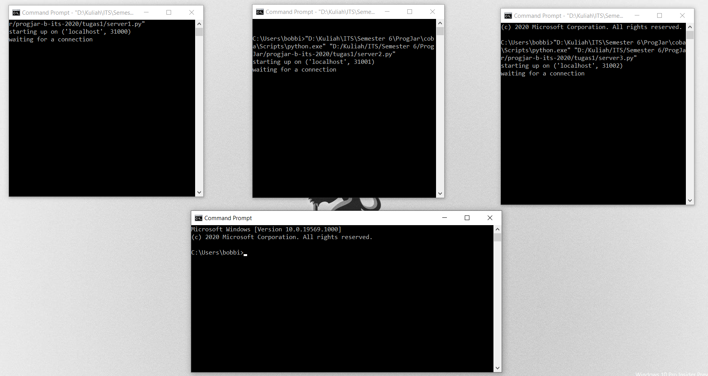

Client mengirimkan pesan ke server port 3100
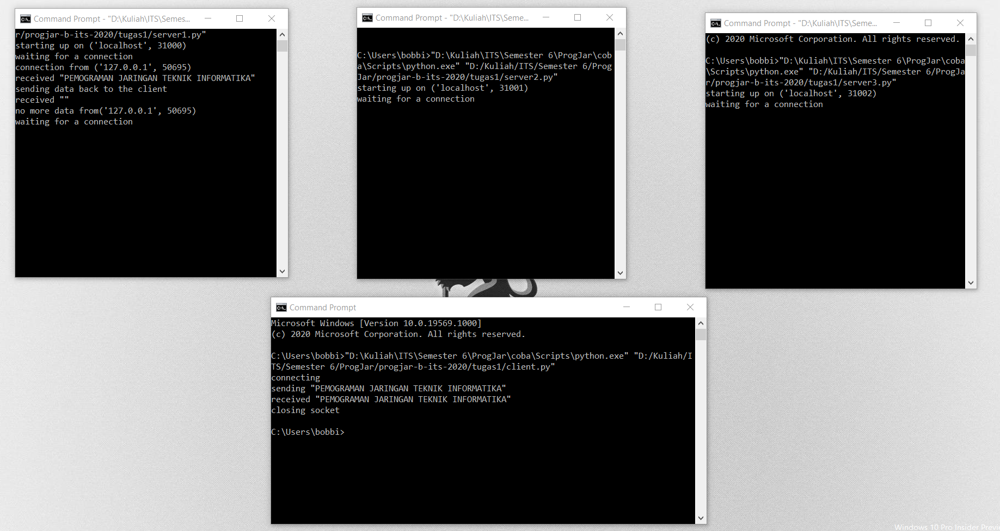

Client mengirimkan pesan ke server port 3101
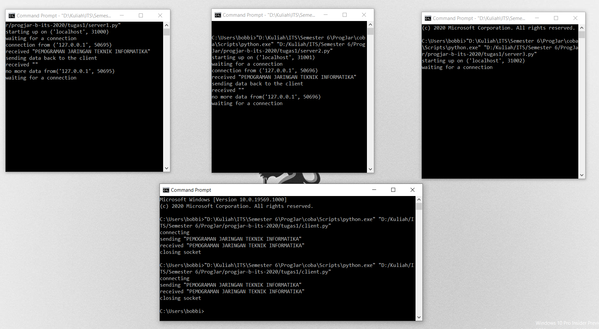

Client mengirimkan pesan ke server port 3102
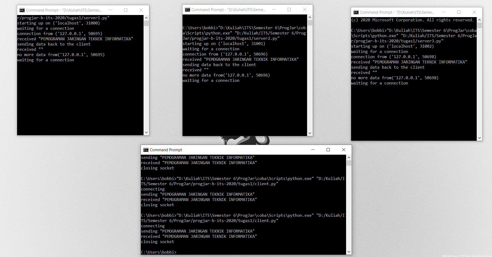

### Server dijalankan di komputer yang berbeda, client mencoba untuk mengirimkan file
Kondisi awal server di komputer yang berbeda(ip=192.168.1.7)

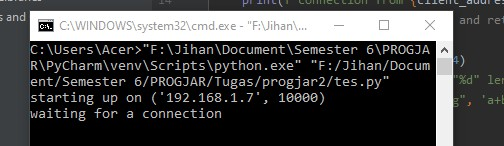

Client(pc saya dengan ip=192.168.1.19) mengirimkan file ke server

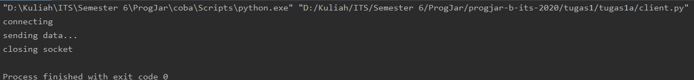

Server setelah mendapatkan kiriman file

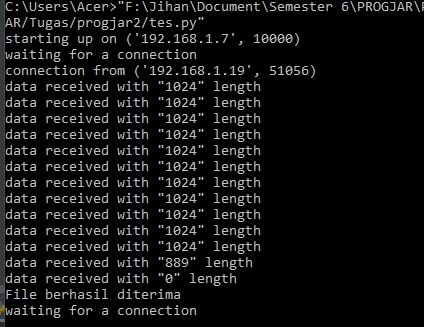

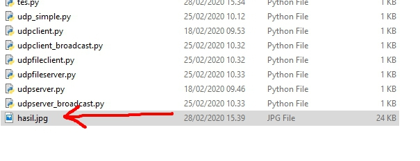

### Server dijalankan di komputer saya, client(komputer lain) request file untuk dikirimkan dari server
Kondisi awal server di pc saya(ip=192.168.1.19)
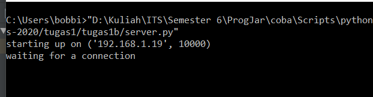 

Client(ip=192.168.1.7) meminta dan mendapatkan file dengan nama *22958.jpg*

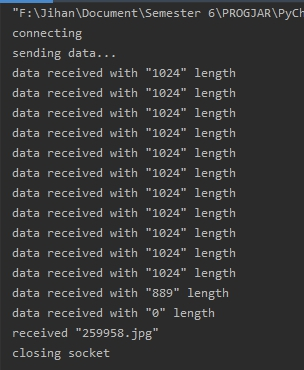

Server menerima request dan mengirimkan file yang ada

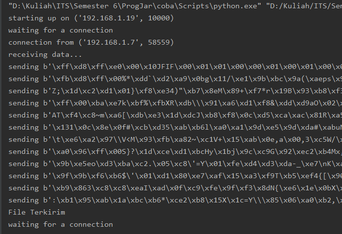

Client berhasil mendapatkan file dengan nama *hasil22958.jpg*

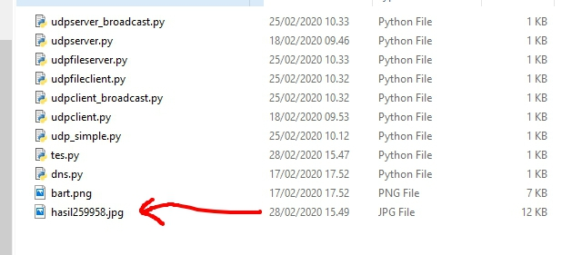