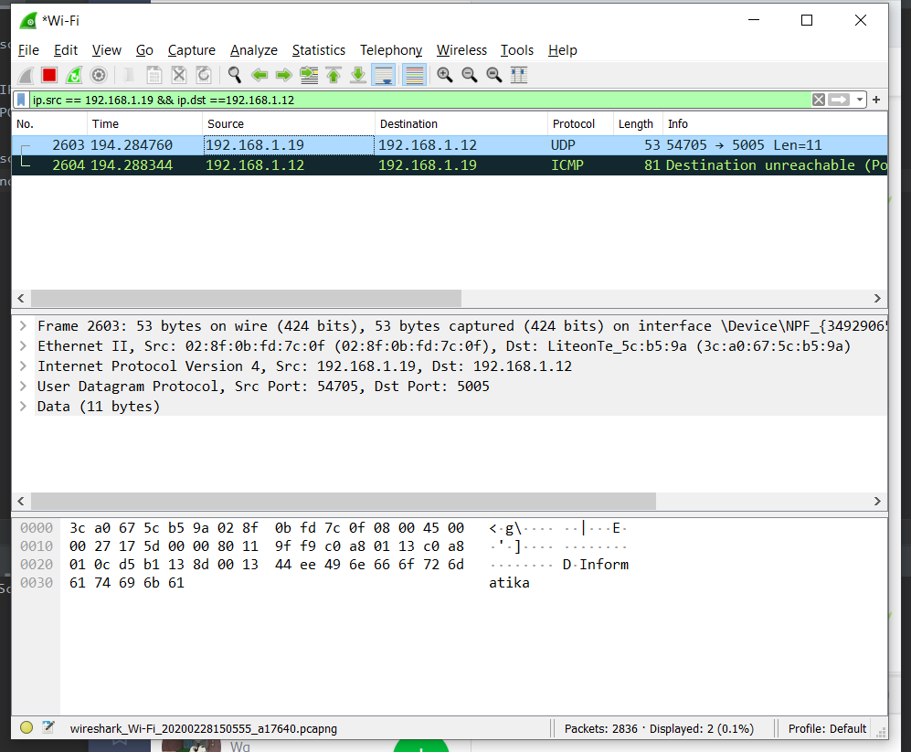

# Tugas 2

### Menjalankan udp_simple dari pc saya(ip=127.0.0.1) ke localhost (127.0.0.1) dengan port 5006.
Pesan yang dikirmkankan adalah *Informatika*

### Menjalankan udp_fileclient dari pc saya(ip=127.0.0.1) ke localhost (127.0.0.1) dengan port 5006.
File yang dikirimkan adalah *bart.png*

### Menjalankan udp_simple dari pc saya(ip=192.168.1.19) ke pc lainnya(192.168.1.12) dengan port 5005.
Pesan yang dikirmkankan adalah *Informatika*

### Menjalankan udp_fileclient dari pc saya(ip=192.168.1.19) ke pc lainnya(192.168.1.12) dengan port 5005
File yang dikirimkan adalah *bart.png*

Jika ingin melihat hasil dari wireshark bisa membuka file **file_client.pcapng** untuk rekaman kiriman udp ke pc lain. File **local.pcapng** untuk rekaman udp ke localhost