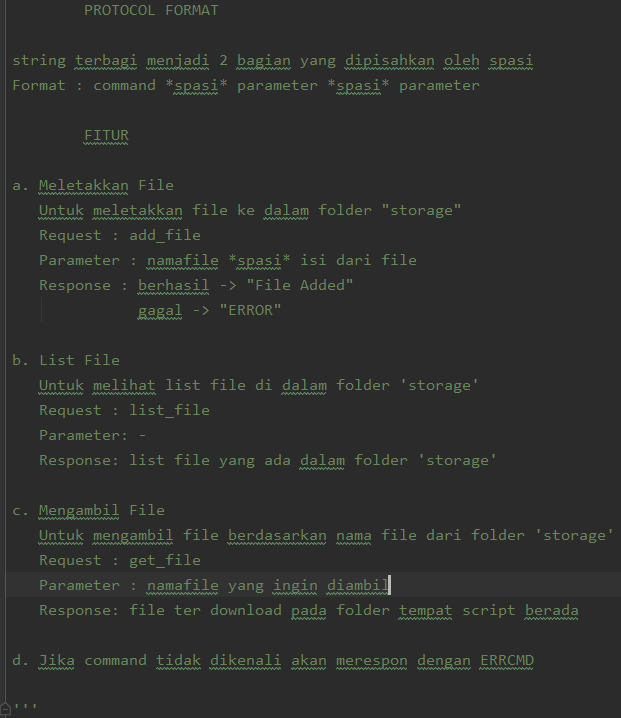
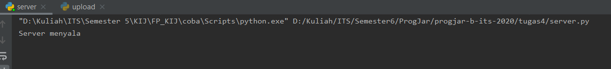
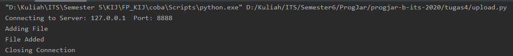
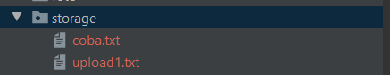
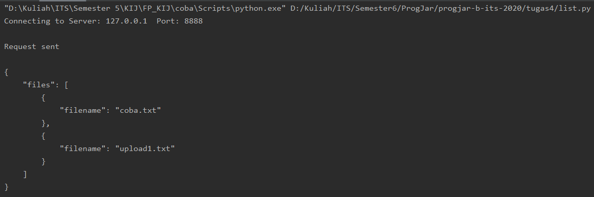
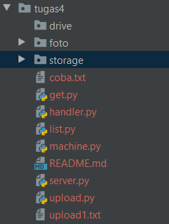
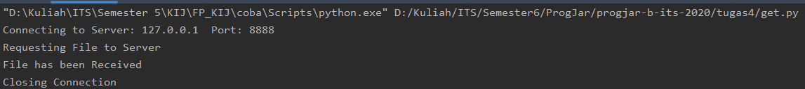
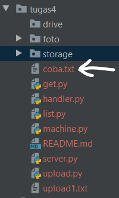

# Tugas 4

Folder penyimpanan file memiliki nama **storage**
### Protokol Jalannya Program

### Menyalakan Server

Kondisi awal storage

###Meletakkan File (function add_file)
File yang dicoba untuk diupload adalah *upload1.txt*

File *upload1.txt* berhasil masuk di folder storage

### Melihat list file (function list_file)
Melihat list file yang ada dalam folder storage

### Mengambil file (function get_file)
Mengambil/mendownload file **coba.txt** yang ada dalam folder storage. File diletakkan di folder program berjalan

Kondisi awal folder program

Program dijalankan

Kondisi akhir folder program setelah program dijalankan

 