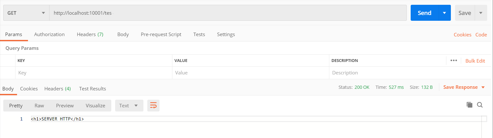
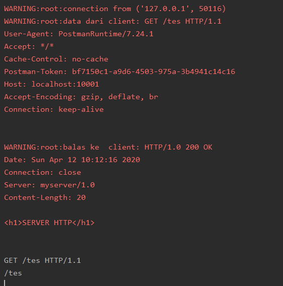
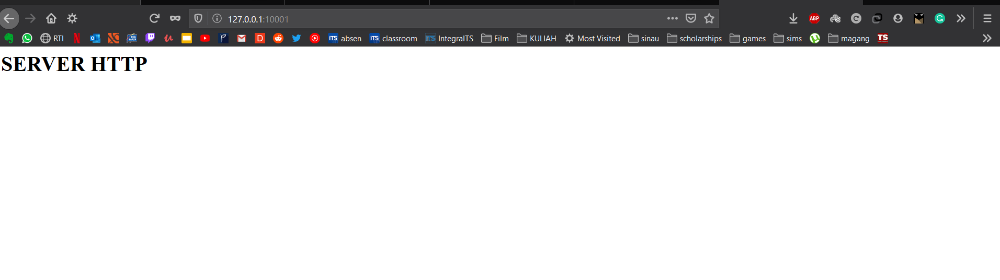
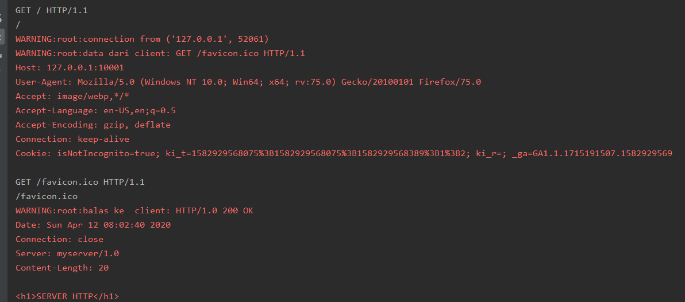

# Tugas 6

### Melakukan request dari postman ke localhost (127.0.0.1:10001)

#### Balasan dari server

### Melakuakn request dari browser (membuka page 127.0.0.1:10001)

#### Balasan dari server 
